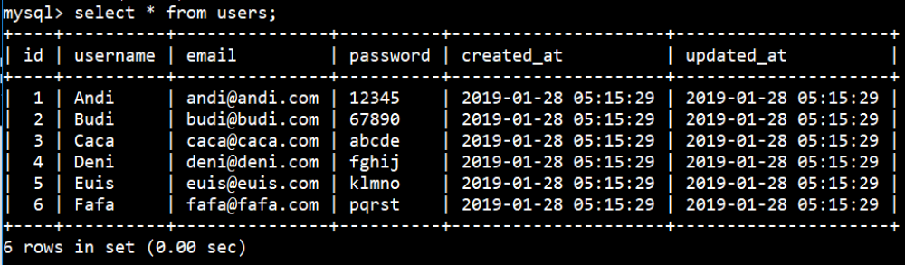
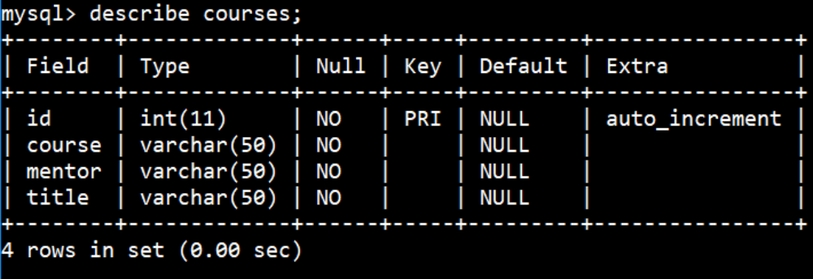
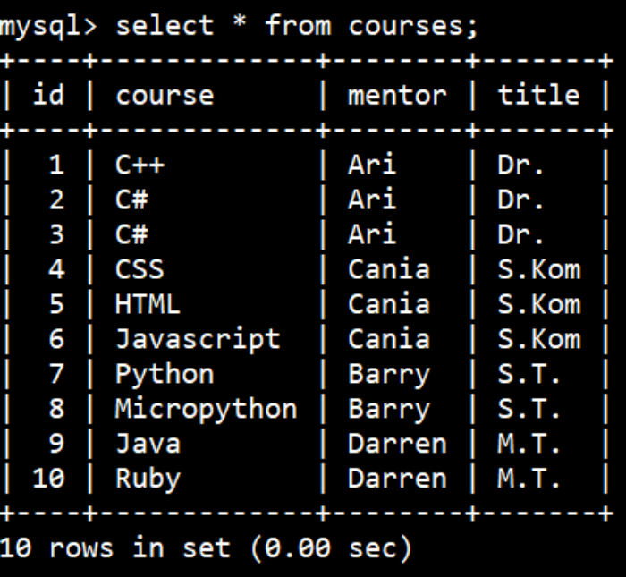
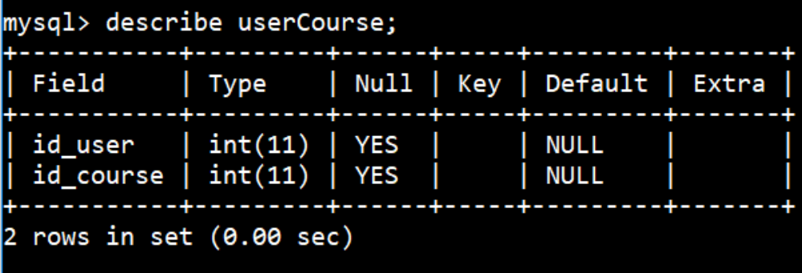
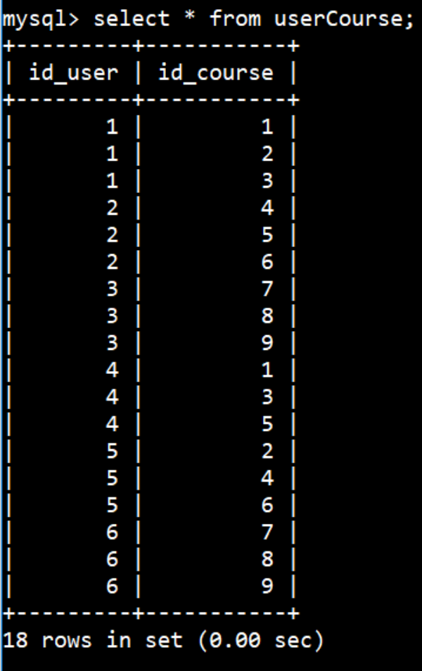
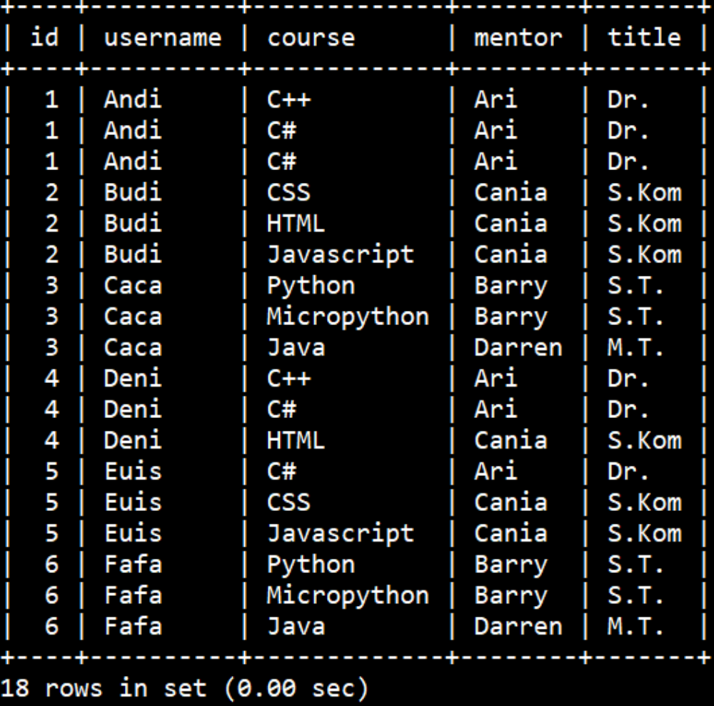
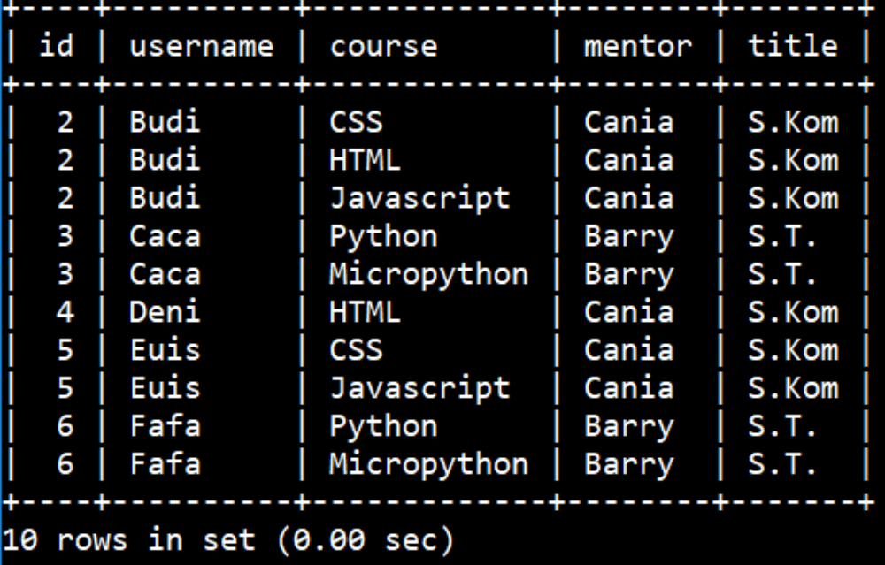
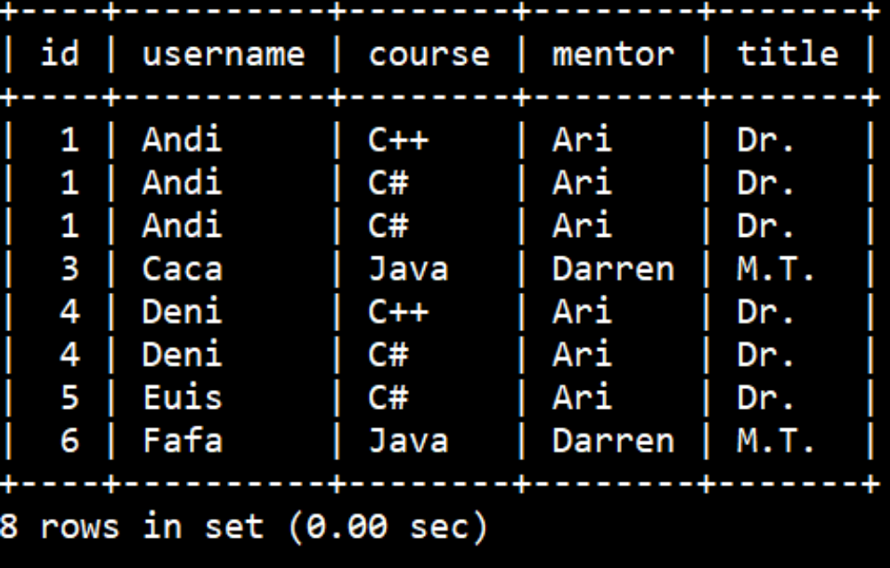
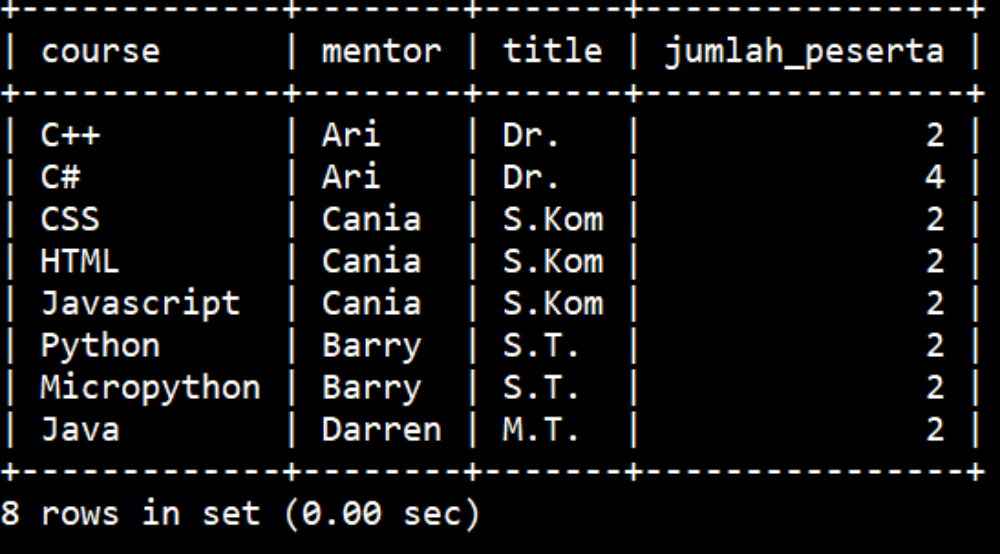
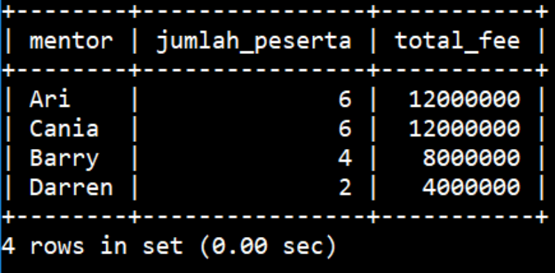

# Soal Ujian Purwadhika Back-End Dev


**Materi Back End Web Dev dapat diakses di [klik sini!](https://github.com/LintangWisesa/Purwadhika-JC05-03_BackEndWeb)**

#

### **Soal 1 - MySQL Database**

Tuliskan langkah-langkah/urutan query MySQL untuk membuat sebuah database **"sekolahku"** yang memiliki beberapa tabel: __"users"__, **"courses"** dan __"userCourse"__, dengan ketentuan di bawah ini:

1. Buatlah tabel **"users"** yang memiliki struktur/model sebagai berikut. Tabel __"users"__ merupakan kumpulan data peserta didik di sebuah sekolah.

    

    Masukkan beberapa data berikut ke dalam tabel __"users"__. Hasil yang diharapkan adalah:

    

2. Buatlah tabel **"courses"** yang memiliki struktur/model sebagai berikut. Tabel __"courses"__ merupakan kumpulan data mata kuliah yang diajarkan di sebuah sekolah.

    

    Masukkan beberapa data berikut ke dalam tabel __"courses"__. Hasil yang diharapkan adalah:

    

3. Buatlah tabel **"userCourse"** yang memiliki struktur/model sebagai berikut. Tabel __"userCourse"__ merupakan tabel penghubung/transaksi antara tabel __"user"__ & __"courses"__.

    

    Masukkan beberapa data berikut ke dalam tabel __"userCourse"__. Hasil yang diharapkan adalah:

    

4. Dari tabel __"users"__, **"courses"** dan __"userCourse"__, tampilkan semua daftar peserta didik beserta mata kuliah yang diikutinya, lengkap dengan nama & gelar mentornya. Hasil yang diharapkan adalah sebagai berikut:

    

5. Dari tabel __"users"__, **"courses"** dan __"userCourse"__, tampilkan daftar peserta didik beserta mata kuliah yang diikutinya, __yang mentornya bergelar sarjana__. Hasil yang diharapkan adalah sebagai berikut:

    

6. Dari tabel __"users"__, **"courses"** dan __"userCourse"__, tampilkan daftar peserta didik beserta mata kuliah yang diikutinya, __yang mentornya bergelar selain sarjana__. Hasil yang diharapkan adalah sebagai berikut:

    

7. Dari tabel __"users"__, **"courses"** dan __"userCourse"__, tampilkan __jumlah peserta didik__ untuk setiap mata kuliah. Hasil yang diharapkan adalah sebagai berikut:

    

8. Dari tabel __"users"__, **"courses"** dan __"userCourse"__, tampilkan __jumlah peserta didik__ beserta __total fee__ untuk setiap mentor. Total fee dihitung dengan besaran Rp 2.000.000,- per peserta didik. Hasil yang diharapkan adalah sebagai berikut:

    

_**Catatan:**_ _Soal ini hanya meminta Anda untuk menuliskan langkah-langkah/urutan query MySQL sesuai spesifikasi di atas. Ketik jawaban dalam sebuah file __.txt__ & lampirkan via email lintang@purwadhika.com!_

#

### **Soal 2 - Express & MongoDB**

Buatlah sebuah project back-end NodeJS (__Express.js__) sederhana yang mampu mengakses database MongoDB (gunakan __Mongoose__!), dengan spesifikasi route sebagai berikut:

- __*POST /data*__ &rarr; tanpa mengirimkan data via _**body request**_, akan memasukkan data ke collection **"data"** di database **"dataCPU"**. Data yang tersimpan adalah data seputar sistem operasi yang digunakan user, mencakup: **nama CPU, tipe OS, platform OS, versi rilis OS, RAM tersisa** dan **RAM total**. Sekali lagi, data yang akan disimpan tidak perlu dideklarasikan di _**body request**_!

    > __POST__ */data*

- **_GET /data_** &rarr; akan memberikan response: menampilkan semua data dari collection **"data"** di database **"dataCPU"**. Data satuan yang ditampilkan diharapkan sebagai berikut:

    ```bash
    {   
        _id: 5b453fb83de88413bc523928,
        namacpu: 'Lintang_CPU',
        tipe: 'Windows_NT',
        platform: 'win32',
        rilis: '10.0.17134',
        ramSisa: 11338039296,
        ramTotal: 17063497728
    }
    ```

- Gunakan __Express Router__ untuk memisahkan code route ke MongoDB dengan code utama project.

_**Catatan:**_ _Upload source code project ke repo __Github__ Anda, kemudian lampirkan __url link repo Github__ Anda via email: lintang@purwadhika.com!_

#

### **Soal 3 - Express & MySQL**

Buatlah sebuah project back-end NodeJS (__Express.js__) sederhana yang mampu melakukan proses autentikasi (__signup__ & __login__) dengan mengakses tabel __"users"__ di database __"sekolahku"__ (*dari soal nomor 1*), dengan spesifikasi route sebagai berikut:

- __*POST /signup*__ &rarr; akan melakukan proses __signup__: memasukkan data user baru ke tabel **"users"** di database **"sekolahku"**. Response yang diberikan setelah request memasukkan data sukses dilakukan adalah sebagai berikut:

    ```json
    {
        "username": "Lintang",
        "email": "lintang@purwadhika.com",
        "status": "Signup sukses"
    }
    ```

- __*POST /login*__ &rarr; akan melakukan proses __login__. Client dapat melakukan proses login cukup dengan mengirimkan __"username" *ATAU* "email"__ saja, beserta __"password"__-nya. Response yang diberikan setelah request login sukses dilakukan adalah sebagai berikut:

    ```json
    {
        "login": "ok",
        "status": "Login sukses"
    }
    ```
    
    Jika __"username"__ dan/atau __"email"__ untuk login tidak terdaftar di tabel __"users"__, maka proses login gagal & response yang ditampilkan sebagai berikut:

    ```json
    {
        "login": "failed",
        "status": "Login gagal"
    }
    ```

    Jika __"username"__ dan/atau __"email"__ untuk login sudah terdaftar di tabel __"users"__, namun __"password"__ yang dimasukkan salah, maka proses login gagal & response yang ditampilkan sebagai berikut:

    ```json
    {
        "login": "failed",
        "status": "Password salah"
    }
    ```

- Gunakan __Express Router__ untuk memisahkan code route autentikasi ke MySQL dengan code utama project.

_**Catatan:**_ _Upload source code project ke repo __Github__ Anda, kemudian lampirkan __url link repo Github__ Anda via email: lintang@purwadhika.com!_

#

### *__#HappyCoding__ :relaxed:*

#### Lintang Wisesa :love_letter: _lintangwisesa@ymail.com_

[Facebook](https://www.facebook.com/lintangbagus) | 
[Twitter](https://twitter.com/Lintang_Wisesa) |
[Google+](https://plus.google.com/u/0/+LintangWisesa1) |
[Youtube](https://www.youtube.com/user/lintangbagus) | 
:octocat: [GitHub](https://github.com/LintangWisesa) |
[Hackster](https://www.hackster.io/lintangwisesa)
